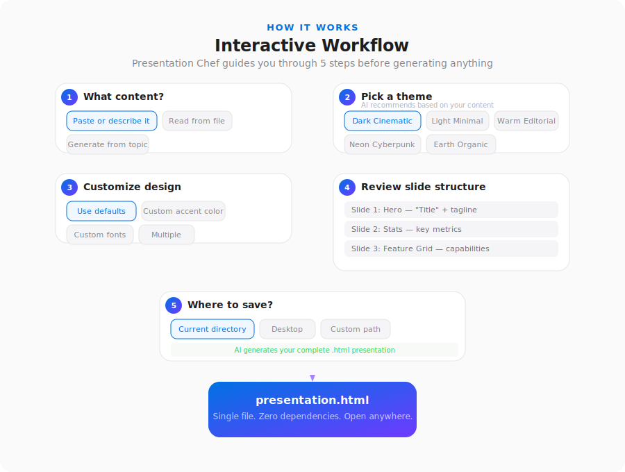

# Presentation Chef

[](LICENSE)
[](https://github.com/sacredvoid/presentation-chef/releases)
[](https://sacredvoid.github.io/presentation-chef)

Convert any content into Apple Keynote-style HTML presentations — from any AI coding tool.

Cinematic animations, glassmorphism, ambient effects, speaker notes, PDF export — all in a **single self-contained `.html` file** with zero dependencies. Inspired by [ChronicleHQ](https://chroniclehq.com).

**[View Live Demo](https://sacredvoid.github.io/presentation-chef)**

## Sample Output

<p align="center">
  
  
</p>
<p align="center">
  
  
</p>
<p align="center">
  
  
</p>

## Interactive Workflow

Presentation Chef doesn't just dump slides on you. It walks you through an interactive flow, asking questions at each step so you stay in control of the output.

<p align="center">
  
</p>

You choose the content source, pick a theme (with AI-powered recommendations based on your content), customize colors and fonts, review the proposed slide structure, and pick where to save. Only then does it generate.

## Installation

Presentation Chef is a markdown-based skill/rule that works with any AI coding assistant. Pick your tool below.

<details open>
<summary><strong>Claude Code</strong></summary>

Add the marketplace and install the plugin:

```
/plugin marketplace add sacredvoid/presentation-chef
/plugin install presentation-chef@sacredvoid-presentation-chef
```

Or manually copy `skills/presentation-chef/SKILL.md` to `~/.claude/skills/presentation-chef/SKILL.md`.

Then invoke with:
```
/presentation-chef
```

</details>

<details>
<summary><strong>Cursor</strong></summary>

Copy `skills/presentation-chef/SKILL.md` into your project:

```
.cursor/rules/presentation-chef.mdc
```

Add this frontmatter at the top of the file:

```yaml
---
description: "Generate cinematic HTML presentations from any content. Invoke when user asks to create a presentation, pitch deck, or slide deck."
alwaysApply: false
---
```

</details>

<details>
<summary><strong>Windsurf</strong></summary>

Copy `skills/presentation-chef/SKILL.md` to:

```
.windsurf/rules/presentation-chef.md
```

Set activation mode to **Manual** or **Model Decision** in Windsurf settings.

</details>

<details>
<summary><strong>GitHub Copilot</strong></summary>

Copy `skills/presentation-chef/SKILL.md` to:

```
.github/instructions/presentation-chef.instructions.md
```

Add this frontmatter at the top:

```yaml
---
applyTo: ""
---
```

Then reference it in Copilot Chat when you want to generate a presentation.

</details>

<details>
<summary><strong>Cline</strong></summary>

Copy `skills/presentation-chef/SKILL.md` to:

```
.clinerules/presentation-chef.md
```

Cline will automatically merge it into its rule set.

</details>

<details>
<summary><strong>Continue.dev</strong></summary>

Copy `skills/presentation-chef/SKILL.md` to:

```
.continue/rules/presentation-chef.md
```

Add this frontmatter at the top:

```yaml
---
name: Presentation Chef
alwaysApply: false
description: "Generate cinematic HTML presentations from any content"
---
```

</details>

<details>
<summary><strong>Aider</strong></summary>

Add the skill as a read-only context file in `.aider.conf.yml`:

```yaml
read: skills/presentation-chef/SKILL.md
```

Or reference it directly when starting Aider:

```bash
aider --read skills/presentation-chef/SKILL.md
```

</details>

<details>
<summary><strong>Zed AI</strong></summary>

Copy `skills/presentation-chef/SKILL.md` to your project root as:

```
.rules
```

Or append it to an existing `.rules` file. Zed loads the first rules file it finds in the project root.

</details>

<details>
<summary><strong>Augment Code</strong></summary>

Copy `skills/presentation-chef/SKILL.md` to:

```
.augment/rules/presentation-chef.md
```

Set rule type to **Manual** in Augment settings.

</details>

<details>
<summary><strong>Amazon Q Developer</strong></summary>

Copy `skills/presentation-chef/SKILL.md` to:

```
.amazonq/rules/presentation-chef.md
```

Amazon Q will automatically load it as context for chat interactions.

</details>

<details>
<summary><strong>Any Other AI Tool</strong></summary>

The skill file at `skills/presentation-chef/SKILL.md` is plain markdown with a complete design system specification. You can use it with any AI assistant that accepts custom instructions or system prompts — just paste or reference the file contents.

</details>

## Themes

| Theme | Vibe | Best For |
|-------|------|----------|
| Dark Cinematic | Apple keynote aesthetic, ambient orbs, grain | Portfolios, product launches, pitch decks |
| Light Minimal | Clean Chronicle-style white canvas | Reports, educational, corporate |
| Warm Editorial | Magazine-style with serif typography | Personal stories, creative work |
| Neon Cyberpunk | High-energy tech with neon accents | Startup pitches, tech demos, hackathons |
| Earth Organic | Calm, natural with rounded aesthetics | Wellness, sustainability, nonprofit |

All themes support full customization of colors, fonts, animations, and effects.

## Slide Types

13 built-in: Hero, Stats, Chapter, Content Card, Feature Grid, Timeline, Comparison, Quote, Image, Data, Split Screen, List, and CTA.

## What's Included

- All CSS, JS, and content inline in one file. Zero dependencies. Open anywhere.
- Speaker notes (`T` to toggle), PDF export (`P` to print)
- Keyboard, mouse wheel, and touch swipe navigation
- Cinematic scale+fade transitions with spring easing
- Staggered reveal animations per slide
- Responsive across desktop, tablet, and mobile
- Ambient effects: grain overlay, blurred orbs, hero glow rings, glassmorphism cards

## How It Works

Presentation Chef is a **markdown-based AI skill** — a structured set of instructions that tells any AI coding assistant how to generate presentations. It includes a complete CSS design system, 13 HTML slide templates, a JS engine spec, and a quality checklist.

No build step, no npm install, no framework — just a single HTML file.

## License

[MIT](LICENSE)
