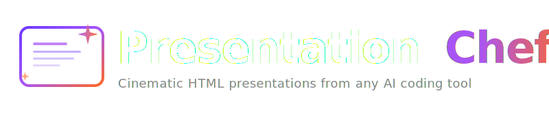

<p align="center">
  
</p>

<p align="center">
  <strong>Convert any content into stunning Apple Keynote-style HTML presentations — from any AI coding tool.</strong>
</p>

<p align="center">
  <a href="https://github.com/sacredvoid/presentation-chef/blob/main/LICENSE"></a>
  <a href="#installation"></a>
  <a href="#features"></a>
  <a href="#features"></a>
</p>

<p align="center">
  <a href="#installation">Install</a> &bull;
  <a href="#usage">Usage</a> &bull;
  <a href="#theme-presets">Themes</a> &bull;
  <a href="#slide-types-13-built-in">Slides</a> &bull;
  <a href="#features">Features</a>
</p>

---

Cinematic animations, glassmorphism cards, ambient orb effects, staggered reveals, speaker notes, PDF export — all generated as a **single self-contained `.html` file** with zero dependencies.

Inspired by [ChronicleHQ](https://chroniclehq.com) and Apple's keynote presentation aesthetic.

---

## Installation

Presentation Chef is a markdown-based skill/rule that works with any AI coding assistant. Pick your tool below.

<details open>
<summary><strong>Claude Code</strong></summary>

```bash
# Install from GitHub
/install-skill sacredvoid/presentation-chef
```

Or manually copy `skills/presentation-chef/SKILL.md` to `~/.claude/skills/presentation-chef/SKILL.md`.

Then invoke with:
```
/presentation-chef
```

</details>

<details>
<summary><strong>Cursor</strong></summary>

Copy `skills/presentation-chef/SKILL.md` into your project:

```
.cursor/rules/presentation-chef.mdc
```

Add this frontmatter at the top of the file:

```yaml
---
description: "Generate cinematic HTML presentations from any content. Invoke when user asks to create a presentation, pitch deck, or slide deck."
alwaysApply: false
---
```

</details>

<details>
<summary><strong>Windsurf</strong></summary>

Copy `skills/presentation-chef/SKILL.md` to:

```
.windsurf/rules/presentation-chef.md
```

Set activation mode to **Manual** or **Model Decision** in Windsurf settings.

</details>

<details>
<summary><strong>GitHub Copilot</strong></summary>

Copy `skills/presentation-chef/SKILL.md` to:

```
.github/instructions/presentation-chef.instructions.md
```

Add this frontmatter at the top:

```yaml
---
applyTo: ""
---
```

Then reference it in Copilot Chat when you want to generate a presentation.

</details>

<details>
<summary><strong>Cline</strong></summary>

Copy `skills/presentation-chef/SKILL.md` to:

```
.clinerules/presentation-chef.md
```

Cline will automatically merge it into its rule set.

</details>

<details>
<summary><strong>Continue.dev</strong></summary>

Copy `skills/presentation-chef/SKILL.md` to:

```
.continue/rules/presentation-chef.md
```

Add this frontmatter at the top:

```yaml
---
name: Presentation Chef
alwaysApply: false
description: "Generate cinematic HTML presentations from any content"
---
```

</details>

<details>
<summary><strong>Aider</strong></summary>

Add the skill as a read-only context file in `.aider.conf.yml`:

```yaml
read: skills/presentation-chef/SKILL.md
```

Or reference it directly when starting Aider:

```bash
aider --read skills/presentation-chef/SKILL.md
```

</details>

<details>
<summary><strong>Zed AI</strong></summary>

Copy `skills/presentation-chef/SKILL.md` to your project root as:

```
.rules
```

Or append it to an existing `.rules` file. Zed loads the first rules file it finds in the project root.

</details>

<details>
<summary><strong>Augment Code</strong></summary>

Copy `skills/presentation-chef/SKILL.md` to:

```
.augment/rules/presentation-chef.md
```

Set rule type to **Manual** in Augment settings.

</details>

<details>
<summary><strong>Amazon Q Developer</strong></summary>

Copy `skills/presentation-chef/SKILL.md` to:

```
.amazonq/rules/presentation-chef.md
```

Amazon Q will automatically load it as context for chat interactions.

</details>

<details>
<summary><strong>Any Other AI Tool</strong></summary>

The skill file at `skills/presentation-chef/SKILL.md` is plain markdown with a complete design system specification. You can use it with any AI assistant that accepts custom instructions or system prompts — just paste or reference the file contents.

</details>

---

## Usage

Once installed, ask your AI assistant to create a presentation. The skill will interactively guide you through:

1. **Content input** — Paste text, point to a file, or describe a topic
2. **Theme selection** — 5 built-in presets with AI-recommended picks based on content
3. **Design customization** — Override colors, fonts, and effects
4. **Slide structure** — Review and approve the proposed layout
5. **Output** — Single `.html` file, open in any browser

## Theme Presets

| Theme | Vibe | Best For |
|-------|------|----------|
| **Dark Cinematic** | Apple keynote aesthetic, ambient orbs, grain overlay | Portfolios, product launches, pitch decks |
| **Light Minimal** | Clean Chronicle-style white canvas | Reports, educational, corporate |
| **Warm Editorial** | Magazine-style with serif typography | Personal stories, creative work |
| **Neon Cyberpunk** | High-energy tech with neon accents | Startup pitches, tech demos, hackathons |
| **Earth Organic** | Calm, natural with rounded aesthetics | Wellness, sustainability, nonprofit |

All themes support full customization of colors, fonts, animations, and effects.

## Slide Types (13 built-in)

| Type | Description |
|------|-------------|
| **Hero** | Big title with glow ring and ambient effects |
| **Stats** | Animated count-up numbers with gradient text |
| **Chapter** | Section divider with dramatic typography |
| **Content Card** | Frosted glass card with rich text |
| **Feature Grid** | Hoverable chip grid for skills, tech, features |
| **Timeline** | Chronological journey with connected markers |
| **Comparison** | Side-by-side with vertical divider |
| **Quote** | Large testimonial/pullquote display |
| **Image** | Full-bleed visual with text overlay |
| **Data** | CSS-only animated bar charts |
| **Split Screen** | 50/50 text and visual layout |
| **List** | Icon + title + description rows |
| **CTA** | Call to action with pill links and status badge |

## Features

| Feature | Details |
|---------|---------|
| **Single file output** | All CSS, JS, and content inline. Zero dependencies. Open anywhere. |
| **Speaker notes** | Press `T` to toggle a frosted glass sidebar with per-slide talking points |
| **PDF export** | Press `P` to export. Animated numbers snap to final values before print. |
| **Full navigation** | Keyboard (arrows, space, page up/down), mouse wheel, touch swipe, clickable dots |
| **Cinematic transitions** | Scale + fade with spring easing (900ms) |
| **Staggered reveals** | Elements animate in sequence per slide |
| **Responsive** | Desktop, tablet, and mobile |
| **Ambient effects** | Grain overlay, blurred color orbs with parallax, hero glow rings |
| **Glassmorphism** | Backdrop-filter blur, semi-transparent borders, top highlight lines |
| **Progress bar** | Gradient progress indicator at top of viewport |

## How It Works

Presentation Chef is a **markdown-based AI skill** — a structured set of instructions that tells any AI coding assistant how to generate presentations. It includes:

- A complete CSS design system with theme tokens
- 13 HTML slide type templates
- A JavaScript engine specification (navigation, animations, touch/keyboard handling)
- Speaker notes and PDF export specifications
- A quality checklist to verify output correctness

No build step, no npm install, no framework — just a single HTML file.

## Keyboard Shortcuts

| Key | Action |
|-----|--------|
| `Arrow Down` / `Space` | Next slide |
| `Arrow Up` | Previous slide |
| `Home` | First slide |
| `End` | Last slide |
| `T` | Toggle speaker notes |
| `P` | Export PDF |
| `Escape` | Close speaker notes |

---

<p align="center">
  <sub>Built by <a href="https://github.com/sacredvoid">@sacredvoid</a> &bull; MIT License</sub>
</p>
